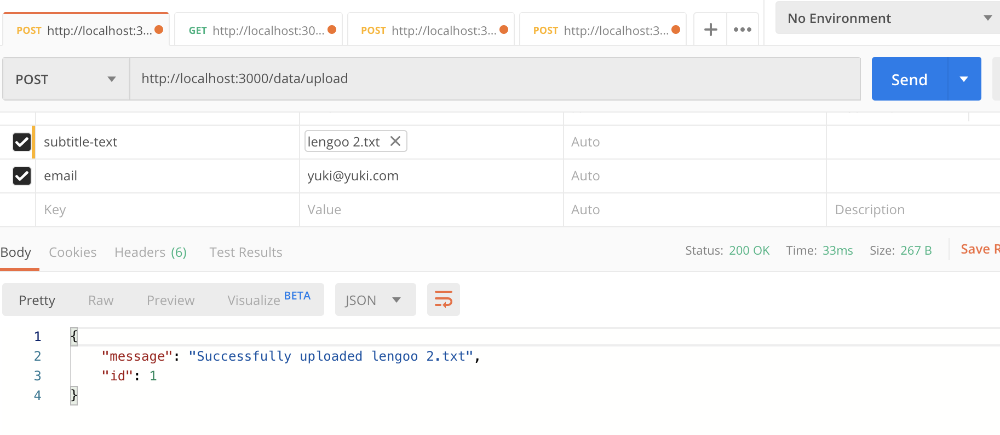

# Coding challenge

**Requirement**　

NodeJS newer than v12.14.1

## How to run the application

1. Clone this repository locally
2. Install all the dependencies at root directory
```
$ yarn install:all

# or 

$ npm run install:all
```
**NOTE:** `yarn install` or `npm run install` does not install all the dependencies of micro servicies. Please make sure to use `install:all`

3. Set environment variables

The application is composed of four different micro services: `gateway` `translator` `tms` and `mailer`.  
To run the application, please set the following environment variables at the **root** directory.

| Variable     |           | Example, Memo|
| ------------- |:--------:| -----:|
| AMQP_URL  | **Required** | Ex. amqps://xxxxx |
| MAIL_HOST  |**Required**      | Ex. smtp.mailtra.io |
| MAIL_PORT | **Required**     |    |
| MAIL_USER | **Required**      |    |
| MAIL_PASS | **Required**     |    |
| GATEWAY_PORT | Optional      | Default value: 3000  |
| TRANSLATOR_PORT | Optional      |Default value: 3001 |
| MAILER_PORT | Optional     | Default value: 3002 |
| TMS_PORT| Optional     |Default value: 3003|
| DEV_MAILSENDER | **Required**     | sender of email|
| DEV_MAILRECIPIENT | Optional      | recipient email to send the test email to|
  

4. Run all the micro services 

I used PM2 to manage the process. If you have not installed PM2, [please install it](https://pm2.keymetrics.io/docs/usage/quick-start/).
```
$ yarn start

# or 

$ npm run start
```

5. Stop all the processes
```
$ yarn stop

# or 

$ npm run stop
```

**NOTE:** Alternatively, you can run each micro service by running `yarn start` or `npm run start` under the directory of each service. 

Example:
To run only `gateway` service
```
$ cd ./gatweay
$ yarn start

# or

$ npm run start
```

## Usage for client

### 1. To upload a text file for translation
To upload a file which you want to be translated, please send `POST` request to a following endpoint. 

**Endpoint** 

`http://localhost:${GATEWAY_PORT}/data/upload`

**Required keys** 

`email` : your email address - This will be the destination to send the translation result to 

`subtitle-text`: The text file that you want to be translated

Content-type: multipart/form-data

Example of a `POST` request:
```
curl -X POST \
  -H "Content-Type: multipart/form-data" \
  -F "email=yuki@mail.com" \
  -F "subtitle-text=@/Users/yukisato/Desktop/lengoo.txt" \
  http://localhost:3000/data/upload
```

or with Postman: 



**NOTE:** The file must be a text file and the content must follow the following format.

Example of a text file `lengoo.txt`
```
1 [00:00:12.00 - 00:01:20.00] Hello World
2 [00:03:55.00 - 00:04:20.00] Hello guys.
3 [00:04:59.00 - 00:05:30.00] I walk to the supermarket.
```

After you send the `POST` request, you should receive an email with the text file that has the result of the translation.

### 2. To import a dictionary data
To import a dictoinary data which you want to add to TMS, please send `POST` request to a following endpoint. 

**Endpoint** 

`http://localhost:${TMS_PORT}/data`

**Requirement** 

Data: The data needs to be a JSON object that has **ALL** of these keys: `source`, `target`, `sourceLanguage`, `targetLanguage` 

Content-type: application/json

Example of a dictionary data:
```
  {
    "source": "I walk to the supermarket",
    "target": "Ich gehe zum Supermarkt.",
		"sourceLanguage": "en",
		"targetLanguage": "de"
  }
```

Example of a `POST` request
```
curl --header "Content-Type: application/json" \
--request POST \
--data '{"source": "I walk to the supermarket", "target": "Ich gehe zum Supermarkt.","sourceLanguage": "en", "targetLanguage": "de"}' \
http://localhost:3003/data
```

## How to run tests

All the tests can be run by `yarn test` or `npm run test`. 

------
That's it! Hope this works. 🚀 

If you have any questions, please drop me a line at sato.youxi@gmail.com ✉️

Yuki 
